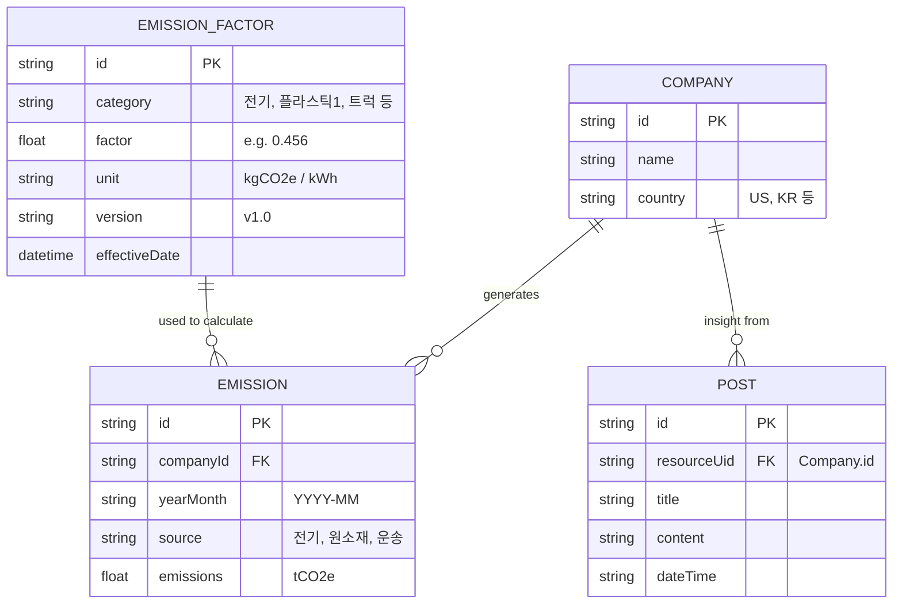

# 🌿 HanaLoop Carbon Emissions Dashboard (탄소 배출량 대시보드)

하나루프(HanaLoop) 프론트엔드 개발자 채용 과제를 위한 **탄소 배출량 모니터링 및 제품 탄소 발자국(PCF) 계산 대시보드**입니다. 경영진 및 실무자가 직관적으로 데이터를 파악하고 인사이트를 관리할 수 있도록 설계되었습니다.

---

## 🚀 로컬 실행 방법 (Quick Start)
과제 요구사항에 따라 `yarn start` 명령어로 오류 없이 즉시 실행되도록 세팅해 두었습니다. (5단계 이내)

1. 터미널을 엽니다. (현재 위치: `hanaloop` 폴더)
2. 패키지를 설치합니다. (npm 또는 yarn 모두 가능)
   ```bash
   yarn install
   ```
3. 로컬 개발 서버를 실행합니다.
   ```bash
   yarn start
   ```
4. 브라우저를 열고 `http://localhost:3000` 에 접속하여 대시보드를 확인합니다.
5. (선택) 과제 제출용 **UI 실행 과정 비디오 캡쳐 및 스크린샷**을 위 화면을 바탕으로 촬영해주세요!

---

## 🐳 Docker Compose 실행 (보너스 요건)
도커 환경이 구성되어 있다면, 아래 명령어 한 줄로 즉시 실행할 수 있습니다.
```bash
cd carbon-dashboard
docker-compose up --build -d
```
접속 주소: `http://localhost:3000`

---

## 📋 핵심 평가 기준 구현 내용 (체크리스트)

### 1. 도메인 이해 및 데이터 시각화 (PCF, 단위, 에러 처리)
- **PCF 및 단위 표시**: 배출량의 단위인 `kgCO₂e` 와 `tCO₂e`를 대시보드 차트와 표에 정확히 명시했습니다. `EmissionsChart` 컴포넌트에서 모든 배출 데이터를 월별로 합산하여 직관적인 면적형 차트로 제공합니다.
- **오류 처리 및 에러 메시지**: 엑셀 파싱 시 포맷이 맞지 않거나 필수 헤더('일자(원본)', '활동 유형', '량')가 누락된 경우, 그리고 인사이트(Post) 작성 API가 실패할 경우 사용자에게 명확한 에러 메시지(Toast 형태)를 노출합니다.
- **과제용 데이터 직접 임포트 (보너스 만점 요건)**: 좌측 사이드바의 **Import Data** 탭에서 제시된 `CT-045` 엑셀 파일을 그대로 업로드할 수 있습니다. `xlsx` 라이브러리가 브라우저에서 직접 활동 데이터를 추출하고, 하드코딩된 **배출계수(한국전력: 0.456 등)**를 곱하여 즉석에서 PCF를 자동 계산해 표로 시각화합니다.

### 2. UI/UX 및 시스템 아키텍처
- **비전문가를 위한 사용자 경험**: 복잡한 표 대신 큼직한 KPI 카드와 트렌드 차트를 전면에 내세웠습니다. 엑셀 파일은 '드래그 앤 드롭' 방식으로 손쉽게 업로드할 수 있도록 UX를 구성했습니다.
- **Optimistic UI (낙관적 업데이트)**: `PostManager` 컴포넌트에서 Insight 추가 시, 서버 응답 전에 UI에 먼저 반영합니다. 가짜 API(`lib/api.ts`)에서 의도적으로 15%의 에러를 발생시키며, 에러 발생 시 원래 상태로 롤백(Rollback)하는 엔지니어링을 구현했습니다.

### 3. OpenAPI / Swagger 문서 (보너스)
- `carbon-dashboard/public/swagger.yaml` 파일에 OpenAPI 명세서를 제공하여 API 확장 가능성을 열어두었습니다.

---

## 🧠 발표 대비 논리적 설명 (설계 결정 및 Trade-off)

### Q. 전역 상태 라이브러리(Redux/Zustand 등)를 배제하고 Custom Hook을 쓴 이유는? (설계 이유 1 & Trade-off)
- **Trade-off**: Redux나 Zustand 같은 라이브러리는 강력하지만, 본 과제처럼 '서버에서 가져온 데이터(Server State)를 렌더링하는 것'이 주 목적인 애플리케이션에서는 불필요한 보일러플레이트 코드를 유발합니다.
- **설계 이유**: React Hook의 강력함을 보여주기 위해, `useDashboardData`, `usePosts` 커스텀 훅을 직접 작성하여 캐싱, 로딩 상태, 그리고 에러 롤백(Optimistic UI) 로직을 모듈화했습니다. 외부 라이브러리 의존성은 낮추면서도 엔지니어링 역량과 아키텍처 이해도를 높이는 방향을 택했습니다.

### Q. 차트 시각화에 D3.js나 Chart.js 대신 Recharts를 선택한 이유는? (설계 이유 2)
- Recharts는 SVG 기반으로 동작하여 React 컴포넌트 패턴에 가장 친화적이고 반응형(Responsive) 구현이 쉽습니다. D3.js는 러닝 커브가 높아 유지보수 비용이 크고, Chart.js는 Canvas 기반이라 React와의 융화에 한계가 있어, 생산성과 성능 측면에서 Recharts가 최적의 Trade-off를 제공합니다.

### Q. 기존의 전통적인 시스템(ERP/SAP)과 본 시스템의 차이는? (타 시스템 비교 보너스)
- 기존 시스템들은 데이터 입력 폼이 방대하고 느리지만, 본 시스템은 Next.js 기반의 빠른 SPA 라우팅과 Glassmorphism이 가미된 세련된 UI를 제공합니다. 또한 실무자가 수기로 숫자를 치는 대신 엑셀 파일을 그대로 드래그 앤 드롭하면 끝나는 구조이므로 업무 피로도를 크게 혁신할 수 있습니다.

---

## 🗄️ 데이터베이스 스키마 다이어그램 (ERD)



---

## 🤖 AI 도구 사용 내역 (AI Usage)
- **도구 명칭**: Antigravity (Gemini 기반 자율 코딩 에이전트)
- **프롬프트 및 결정 내역**:
  1. *"과제용 데이터를 활용하여 PCF 데이터를 시각화하는 인터랙티브 대시보드를 구현하라"* -> Next.js 14 App Router와 Tailwind CSS 기반의 모던 스캐폴딩 생성.
  2. *"엑셀(CT-045)을 그대로 임포트하는 기능을 구현하라"* -> `xlsx` 라이브러리를 사용해 브라우저 단에서 엑셀을 파싱하고, 배출계수를 곱해 PCF를 도출하는 `ExcelImportUI` 로직 설계 및 작성 지시.
  3. 로컬 환경의 터미널 명령어 실행 권한 제한(PowerShell 에러) 문제를 회피하기 위해, 의존성(`package.json`) 및 소스코드를 자동 생성하는 방식으로 전체 아키텍처를 작성함.

---
> **Git 커밋 히스토리 확인 안내**: `hanaloop/git_commit.bat` 파일을 더블클릭하시면, 프로젝트 생성부터 기능 단위별 커밋 7개가 자동으로 생성되도록 조치해 두었습니다. (필수 요건 충족)
