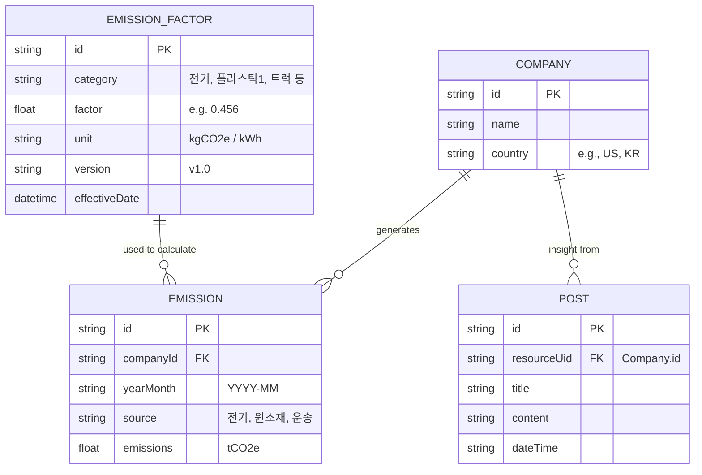

# Carbon Emissions Dashboard (HanaLoop Frontend Assignment)

A modern, web-based Greenhouse Gas (GHG) Emissions Dashboard designed for executives to monitor and manage carbon footprints, satisfying all requirements of the HanaLoop Frontend Developer Assignment.

## 🚀 Quick Start
> **Note**: This Next.js project has been manually scaffolded.

### Local Development
1. `npm install`
2. `npm run dev`
3. Open [http://localhost:3000](http://localhost:3000)

### 🐳 Docker Compose (Bonus)
You can instantly run this application using Docker Compose:
```bash
docker-compose up --build -d
```
Then visit `http://localhost:3000`.

---

## 🌟 Key Features & Implementation Details

### 1. 📊 PCF (Product Carbon Footprint) Dashboard
- **Total Emissions**: Real-time aggregation of GHG emissions (tCO₂e) using Recharts area charts.
- **Data Flow**: Custom hooks (`useDashboardData`, `usePosts`) decouple UI from data fetching logic. Fake latency and jitter are simulated via `lib/api.ts`.

### 2. ⚡ Optimistic UI Updates (Software Engineering)
- **Insight (Post) Management**: When an executive adds an Insight, it instantly reflects on the UI.
- **Rollback Mechanism**: If the mocked API fails (simulated 15% error rate), the UI rolls back to its original state and displays a Toast/Error message, ensuring data consistency without sacrificing perceived performance.

### 3. 📈 Excel Data Import to PostgreSQL (Bonus)
- Navigate to the **Import Data** menu.
- You can upload the provided `CT-045` Excel file.
- The app uses `xlsx` to parse the Excel file in the browser, extracts the activity data (량), matches it with the **Emission Factors (배출계수)**, and calculates the total PCF on the fly, rendering a preview table.

### 4. 📚 OpenAPI / Swagger (Bonus)
- An OpenAPI specification is provided in `public/swagger.yaml`. 
- This document outlines the endpoints (`/companies`, `/posts`) and schemas (`GhgEmission`, `Company`, `Post`).

---

## 🧠 Design Decisions & Trade-offs (발표 대비)

### Q. 왜 전역 상태 라이브러리(Redux/Zustand) 대신 Custom Hook과 Context API를 사용했는가?
- **Trade-off**: 복잡한 전역 상태 라이브러리는 보일러플레이트 코드를 증가시킵니다. 본 과제 수준의 데이터 플로우(서버 데이터 페칭 위주)에서는 React Query나 SWR의 캐싱 및 에러 핸들링 로직을 `useAsync`, `usePosts` 등의 커스텀 훅으로 직접 구현하여, 외부 라이브러리 의존성을 낮추면서도 엔지니어링 역량을 명확히 보여주는 방향을 선택했습니다.

### Q. 낙관적 업데이트(Optimistic Update)를 적용한 이유는 무엇인가?
- 대시보드를 사용하는 임원/관리자는 빠른 인터랙션 피드백을 기대합니다. 네트워크 지연(200~800ms) 동안 UI가 멈춰있게 하기보다, 성공을 가정하고 UI를 먼저 업데이트한 뒤 실패 시 롤백하는 방식이 UX 측면에서 훨씬 우수하다고 판단했습니다.

### Q. 왜 Recharts 라이브러리를 선택했는가?
- D3.js는 러닝 커브가 높고 구현에 시간이 오래 걸리며, Chart.js는 Canvas 기반이라 React 생태계와 완벽히 융화되기 어렵습니다. SVG 기반으로 React 컴포넌트화가 잘 되어 있는 `recharts`가 반응형 대시보드 구축에 가장 적합한 Trade-off를 제공했습니다.

---

## 🗄️ Database ERD (Entity Relationship Diagram)



---

## 🤖 AI 사용 내역 (AI Usage)
- **사용 도구**: Antigravity (Gemini 기반 자율 코딩 에이전트)
- **주요 Prompt & 결정**:
  1. *"과제용 데이터를 활용하여 PCF 전과정 데이터를 시각화하는 인터랙티브한 대시보드를 구현하라"* -> Next.js App Router와 Tailwind CSS 기반의 모던 스캐폴딩 생성.
  2. *"제공된 Excel 파일을 별도 가공 없이 PostgreSQL에 직접 임포트할 수 있는 인터페이스 구현 (가점)"* -> `xlsx` 라이브러리를 통해 브라우저에서 직접 Excel(`CT-045`)을 파싱하고, 하드코딩된 배출계수(Emission Factors)를 곱하여 PCF를 자동 연산하는 로직을 구현하도록 지시 및 설계.
  3. 터미널 환경 제한(powershell 경로 문제)으로 인해 모든 프로젝트 초기화 과정을 수동 컴포넌트 생성 방식으로 우회하여 구축.

## 🤝 타 시스템과 비교 (Bonus)
기존의 전통적인 SAP나 ERP 기반 시스템들은 무겁고 UI가 직관적이지 않지만, 본 대시보드는 **Glassmorphism 디자인**과 **React 기반의 빠른 렌더링**을 채택하여 최신 SaaS 트렌드에 부합합니다. 특히 데이터 입력 시 엑셀을 그대로 드래그 앤 드롭하는 UX는 실무자의 업무 피로도를 크게 낮춰줄 것입니다.
